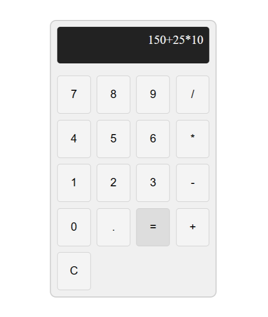

# Calculator (React + TypeScript)

A a simple calculator built with React & TypeScript. 
This project is my first experience with React, and it turned out to be easier than expected.

## Features

- **Button input**
- **Safe logic with math.js**
- **Error handling**
- **Type safety with TypeScript**
- **Component-based structure**

## Installation

1. Clone the repository:
   ```bash
   git clone https://github.com/VaclavKey/React_Calculator.git
2. Navigate to the project directory:
   ```bash
   cd React_Calculator
3. Install dependencies:
   ```bash
   npm install
4. Run the app in development mode:
   ```bash
   npm run dev

## Usage

- Click the buttons to add their label to the expression
- Press "=" to evaluate the expression
- Press "C" to clear the expression

## Example

Here's what the app looks like when running:


